<h3>pratik@github ~ $ ./contributions.sh</h3>

  

<h3>pratik@github ~ $ whoami</h3>

<table>
  <tr>
    <td valign="top">
      
    </td>
    <td valign="top">
      
    </td>
  </tr>
</table>

Turning data, code, and curiosity into intelligent systems.

 

### pratik@github ~ $ ls ./projects

| Project | Description |
| --- | --- |
| `GitIntel` | `[ Project details to be added. ]` |
| `FireGuard AI` | `[ Project details to be added. ]` |
| `Student Helper` | `[ Project details to be added. ]` |
| `KARN` | `[ Project details to be added. ]` |

### pratik@github ~ $ tech-stack

`Python` | `SQL` | `JavaScript` | `Flask` | `React` | `Node.js` | `MongoDB` | `MySQL` | `SQLite` 
`Git` | `GitHub` | `VS Code` | `Power BI` | `Tableau` | `Jupyter` | `Google Colab` | `Postman`

### pratik@github ~ $ building

Building AI and data-driven projects that turn useful ideas into practical, intelligent systems.

### pratik@github ~ $ connect

`LinkedIn` - https://www.linkedin.com/in/pratik-yadav-718a63364/ 
`Email` - pratikyadav0104@gmail.com
